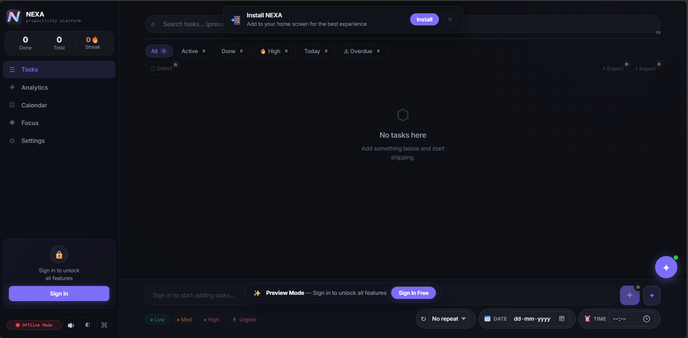
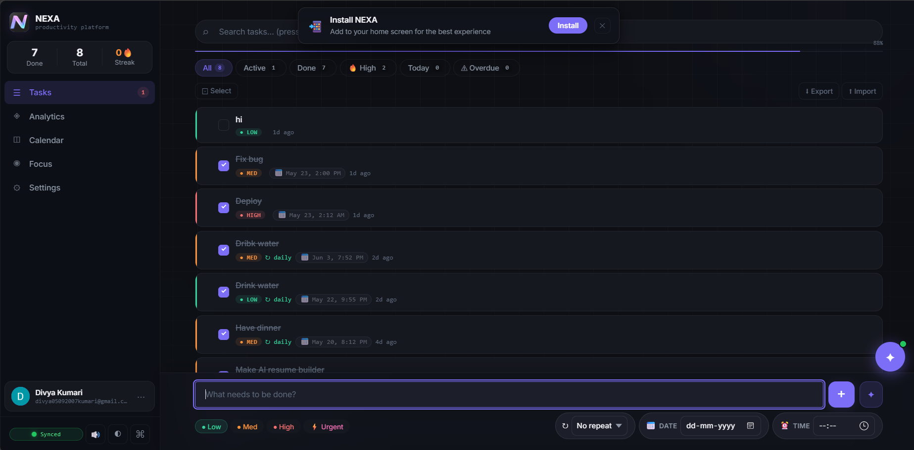

# NEXA 🚀

NEXA is a modern productivity web app designed to help users stay focused, organized, and productive throughout the day.

Built with a clean futuristic UI, responsive mobile experience, dark/light themes, and PWA support, NEXA combines task management, focus tools, reminders, notes, and productivity tracking into one powerful app.

---

# ✨ Features

## 📋 Task Management
- Create, edit, and delete tasks  
- Organize daily workflow  
- Track completed tasks  
- Interactive task interface  

## 🎯 Focus Mode
- Dedicated focus workspace  
- Productivity timer  
- Distraction-free environment  
- Session tracking  

## 📝 Notes System
- Quick notes support  
- Clean note organization  
- Fast access interface  

## 📅 Calendar & Planning
- Daily productivity planning  
- Organized scheduling system  
- Better workflow management  

## 🌙 Dark & Light Theme
- Fully responsive theme switching  
- Theme-safe UI colors  
- Mobile optimized design  

## 📱 Mobile Responsive
- Fully optimized sidebar navigation  
- Smooth mobile interactions  
- Touch-friendly interface  
- Responsive layout for all devices  

## ⚡ Progressive Web App (PWA)
- Installable like a mobile app  
- Offline-ready experience  
- Fast loading performance  
- App-style interface  

---

# 🛠️ Tech Stack
- HTML5  
- CSS3  
- JavaScript  
- PWA (Progressive Web App)  
- Vercel Deployment  

---

# 📸 Screenshots

Here’s a preview of NEXA:

## Dashboard


## Tasks Page


## Focus Mode


---

# 🚀 Live Demo

👉 https://nexa-sandy-five.vercel.app/

---

# 📦 Installation

## Clone the repository
```bash
git clone https://github.com/Divya2007-hub/NEXA.git
````

## Open project folder

```bash
cd NEXA
```

## Run locally

You can run the project using:

* VS Code Live Server
* OR any local development server

Example:

```bash
npx serve
```

---

# 📱 PWA Installation

## On Mobile

* Open the website in Chrome or Samsung Internet
* Tap “Install App”
* Launch NEXA like a native app

## On Desktop

* Open the website in Chrome/Edge
* Click the install icon in the address bar
* Install NEXA

---

# 🎨 UI Highlights

* Futuristic modern interface
* Glassmorphism inspired design
* Smooth animations
* Clean productivity dashboard
* Optimized mobile sidebar
* Elegant dark/light theme support

---

# 🔥 Future Improvements

* AI productivity assistant
* Cloud sync
* Firebase authentication
* Notifications & reminders
* Advanced analytics
* Habit tracking
* Cross-device sync
* Play Store release

---

# 🤝 Contributing

Contributions are welcome.

1. Fork the repository
2. Create your feature branch
3. Commit your changes
4. Push to the branch
5. Open a Pull Request

---

# 👩‍💻 Developer

Developed by Divya Kumari.

GitHub: [https://github.com/Divya2007-hub](https://github.com/Divya2007-hub)

---

# 📄 License

This project is licensed under the MIT License.

---

# ⭐ Support

If you like this project, consider giving it a star ⭐

```
